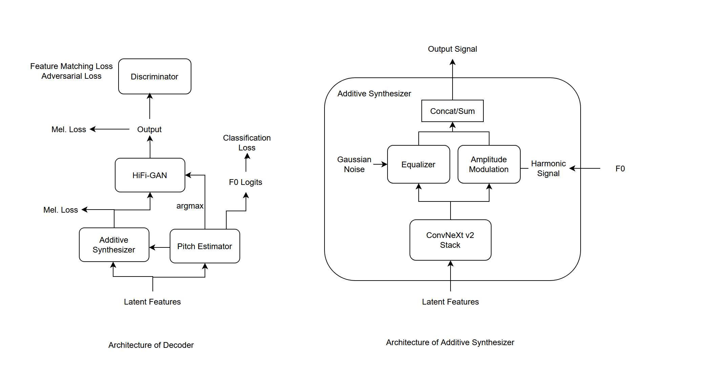

# 技術的な詳細
このドキュメントは、本リポジトリの技術的な詳細を記す。

## 開発の動機
- オープンソースのTTS(Text-To-Speech), SVS(Singing-Voice-Synthesis), SVC(Singing-Voice-Conversion)ができるモデルが欲しい。  
- なるべくライセンスが緩いものがいい。(MITライセンスなど)
- 日本語の事前学習モデルが欲しい。

## モデルアーキテクチャ
VITSをベースに改造するという形になる。  
具体的には、
- DecoderをDSP+HnNSF-HiFiGANに変更
- Text Encoderに言語モデルの特徴量を参照する機能をつけ、感情などを読み取れるように。
- Feature Retrievalを追加し話者の再現性を向上させる
等の改造があげられる。

### 全体の構造

VITSの構造とほぼ同じ。
細かい相違点としては、Decoderが話者情報を取らなくなっている。これは、学習時はPosterior Encoderが、推論時はFlowが話者情報を付与するため、Decoder側で話者情報を付与しなくてもデコードできるだろうという考えからくるものである。

### デコーダー

DDSPのような加算シンセサイザによる音声合成の後にHiFi-GANに似た構造のフィルターをかけるハイブリッド構造。  
ピッチ情報を外部から与えることで、ピッチを制御することも可能。  
音素列、Duration、ピッチを外部から与えることで、歌声生成を可能にする。  

## 学習手法
VITSの大まかな構造として、まず音声を潜在空間にマッピングするVAEが存在し、TTSの機能としてその潜在変数をText Encoder, Duration Predictor, Flowを用いて生成する仕組みと考えることができる。  
この際、TTS機能はVAEによる音声の再構築ができることが前提となっているため、同時に学習するよりもむしろ先にある程度VAEを学習しておいてからTTS機能を調整するほうが良いのではないかと考えた。そのため、本リポジトリではVAEのみを学習する機能が存在する。
